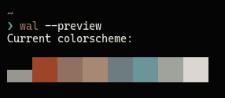

# Reyece

My first Arch rice, documented for the sole purpose of obnoxiously bragging about it on r/UnixPorn and saying "I use arch BTW" all the time.

It's called this way because of the wallpaper. Yeah couldnt come up with a better name.

I'm going to put stuff that could look obvious or dumb to general arch users, but useful for beginners such as me while making this rice.

For information, my usual use of this computer will be for coding all kinds of things mostly, so this rice is pretty much adapted to that use.

## TL:DR
You can download a script that'll set everything up at [this link](https://www.youtube.com/watch?v=dQw4w9WgXcQ).

## Themes
The color schemes were made using [pywal](https://github.com/dylanaraps/pywal) with the wallpaper, that can be found in the `.config` under sway config directory.

Its values are the following : 
1)  #050505
2) #9E4427
3) #927061
4) #A58975
5) #6C7C81
6) #6A9599
7) #A0A29C
8) #dbd6cf
9) #999590

To 

### Font
CascadiaCode

### Discord
[BetterDiscord](https://wiki.archlinux.org/title/Installation_guide) with customized [ClearVision](https://betterdiscord.app/theme/ClearVision) theme.

### Spotify
 [Spicetify](https://github.com/khanhas/spicetify-cli), with a modified [Dribblish](https://github.com/morpheusthewhite/spicetify-themes/blob/master/THEMES.md#dribbblish) theme

### GTK Theme 
[Flat remix](https://github.com/daniruiz/Flat-Remix-GTK) with a custom color theme compiled thanks to their utility. 
Theme files can be found under `usr/share/theme/`.

### Icons Theme
[Zafiro-Icons-Dark]()
Icon files can be found under `usr/share/icons`
### Firefox/Duckduckgo and thunderbird theme : 
[PywalFox](https://github.com/Frewacom/pywalfox)  is used as a local utility and an extension for Firefox and Thunderbird. It uses the last cached values from wal.

### VSCode 
[vscode-wal-theme](https://github.com/dlasagno/vscode-wal-theme) extension. Just as the one in Mozilla apps, this onme checks the last wal generated files to get the color scheme.

## Shell
I use [zsh](https://www.zsh.org/) with [Oh my ZSH](https://ohmyz.sh/).

### Syntax highlighting
 I use [zsh-syntax-highlighting](https://github.com/zsh-users/zsh-syntax-highlighting).

### Autosuggestions
For autosuggestions, I use [zsh-autosuggestions](https://github.com/zsh-users/zsh-autosuggestions).

### Theme
I use a customized [refined](https://github.com/ohmyzsh/ohmyzsh/wiki/Themes#refined).

## Software stack
The rice is based off vanilla Arch, with a Walyand compositor called [Sway](https://swaywm.org/), that is made to be similar to [i3](https://i3wm.org/). In the same attempt, there is [Waybar](https://github.com/Alexays/Waybar) that's made to be compatible with [Polybar](https://polybar.github.io/).

Here are a few of the softwares I used to get the rice usable

---

| Feature | Implementation |
| --- | --- |
| Graphic server | wlroots(wayland) |
| Compositor | [Sway](https://swaywm.org/) |
| Audio server | [Pulseaudio](https://www.freedesktop.org/wiki/Software/PulseAudio/) |
| Bootloader | [Grub](https://www.gnu.org/software/grub/) |
| Status bar | [Waybar](https://github.com/Alexays/Waybar) |
| Progress bar | [Wob](https://github.com/francma/wob) |
| Network | [NetworkManager](https://wiki.archlinux.org/title/NetworkManager) |
| Laptop/keyboard drivers | [OpenRazer](https://openrazer.github.io/) ([Razercommander](https://gabmus.github.io/razerCommander/) GUI) |
| Graphics(Optimus laptop) | Intel for everything, could not make nvidia driver work in any possible way (--my-next-gpu-wont-be-nvidia ;) ) |
| Spotify customization | [Spicetify](https://github.com/khanhas/spicetify-cli) |
| Terminal emulator | [Alacritty](https://alacritty.org/) |
| Lockscreen | [swaylock-effect-git](https://github.com/mortie/swaylock-effects) |
| Launcher | [Wofi](https://hg.sr.ht/~scoopta/wofi) |
| Browser | Mozilla ([PywalFox](https://github.com/Frewacom/pywalfox) colors) |
| Editor | [VScode](https://code.visualstudio.com/) (Closed source version) |
| File browser | [Thunar](https://wiki.archlinux.org/title/Thunar) |
| Screen recording | [OBS](https://obsproject.com/) |
| Screenshots | [slurp](https://github.com/emersion/slurp)/[grim](https://github.com/emersion/grim) |
| Discord mod | [BetterDiscord](https://wiki.archlinux.org/title/Installation_guide) with customized [ClearVision](https://betterdiscord.app/theme/ClearVision) theme |
| Backups | [rsnapshot](https://wiki.archlinux.org/title/Rsnapshot) |
 | Clip Manager | [Clipman](https://github.com/yory8/clipman) |
| Brightness control | [light](https://github.com/haikarainen/light) |
| Emails | [Thunderbird](https://www.thunderbird.net/) |
| Image viewer | [imv](https://github.com/eXeC64/imv) |
| Shell | [zsh](https://www.zsh.org/) with [Oh my ZSH](https://ohmyz.sh/) |
| Editor | nano | 

## Useful resources that I used
* [The obvious Arch installation guide](https://wiki.archlinux.org/title/Installation_guide)
* [Another guide a talented friend of mine wrote](https://github.com/angristan/arch-linux-install)
* [A curated list of Wayland code and resources](https://github.com/natpen/awesome-wayland#screen-locking)
* [A guide for emoji fonts](https://dev.to/darksmile92/get-emojis-working-on-arch-linux-with-noto-fonts-emoji-2a9)

